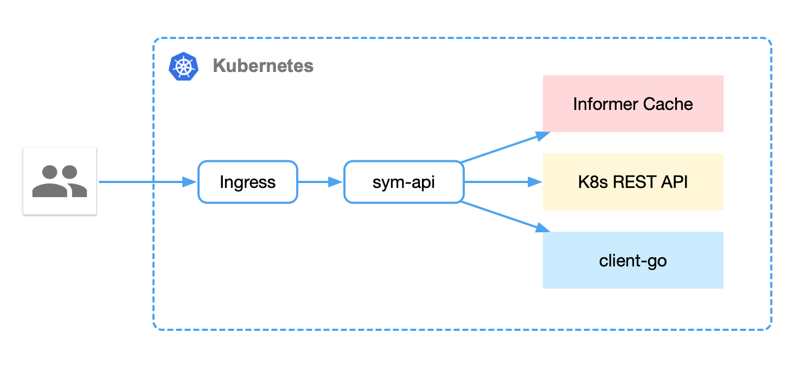

# 架构

# 概述

# 设计

## 声明式

<u>**声明式**</u>（Declarative）的编程是云原生的一大特色，与<u>**命令式编程**</u>相比，能更好的描述一个效果或者目标的终态。

在 Kubernetes 中，我们可以直接使用 YAML 文件定义应用服务在**<u>多集群的拓扑结构和状态</u>**：

~~~yaml
apiVersion: workload.dmall.com/v1beta1
kind: AppSet
metadata:
  name: bbcc
  namespace: default
spec:
  replicas: 10
  podSpec:
    deployType: helm                 # helm, InPlaceSet，StatefulSet, deployment等， 目前支持helm
    chart:                           # helm部署时生效
      chartUrl:                      # helm仓库chart描述
        url: dmall/springBoot        
        chartVersion: 0.0.1
      rawChart: ...                  # 没有helm仓库时可指定原始压缩包  []byte
    template: ...                    # 其他部署方式是pod的原始描述模板 PodTemplateSpec
  serviceName: inner.bbcc.dmall.com  # App 的 service 名称
  updateStrategy:                    # 升级策略
    upgradeType: canary|blue|green   
    minReadySeconds: 10
    canaryClusters:                  # 灰度部署集群拓扑
      - tcc-bj4-dks-test-01
    needWaitingForConfirm: true
    paused: false
  clusterTopology:
    clusters:
      - name: tcc-bj4-dks-test-01
        meta:
          sym-available-zone: bj4
          sym-cluster-info: tcc-bj4-dks-test-01
        podSets:
          - name: bbcc-gz01b-canary
            replicas: 1
            version: v4
          - name: bbcc-gz01b-blue
            replicas: 2
            version: v3
          - name: bbcc-gz01b-green
            replicas: 2      # override replicas
            version: v3      # override version
            image: ...       # override image
            chart: ...       # override chart helm部署时生效
            rawValues: ...   # override rawValues  helm部署时生效
            meta:
              sym-group: green
      - name: tcc-bj5-dks-test-01
        meta:
          sym-available-zone: bj5
          sym-cluster-info: tcc-bj5-dks-test-01
        podSets:
          - name: bbcc-gz01a-canary
            replicas: 1
            version: v4
          - name: bbcc-gz01a-blue
            replicas: 2
            version: v3
          - name: bbcc-gz01a-green
            replicas: 2
            version: v3
~~~

部署完成后可以看到部署的状态：

~~~shell
$ kubectl get as --all-namespaces
NAMESPACE     NAME                      DESIRED   AVAILABLE   UNAVAILABLE   VERSION   STATUS    AGE
dmall-inner   kafka-08-producer-gz01a   6         6           0             v8/v9     Running   3h37m
dmall-inner   kafka-test-group          8         8           0             v2        Running   54m
dmall-inner   no-project-aabb           10        10          0             v5        Running   47h

$ kubectl get ad --all-namespaces
NAMESPACE     NAME                      DESIRED   AVAILABLE   UNAVAILABLE   VERSION   STATUS    AGE
dmall-inner   kafka-08-producer-gz01a   2         2           0             v8/v9     Running   3h39m
dmall-inner   kafka-test-group          4         4           0             v2        Running   56m
dmall-inner   no-project-aabb           4         4           0             v5        Running   47h
~~~

## 控制器模式

控制器采用松耦合的方式组合，启动命令：

~~~shell
# 只启动 AppSetController 控制器
$ sym-controller controller --enable-master -v 4   

 # 只启动 AdvDeploymentController 控制器
$ sym-controller controller --enable-worker -v 4   

# 同时启动 AppSetController 和 AdvDeploymentController 控制器
$ sym-controller controller --enable-master --enable-worker -v 4  
~~~

由于在多集群中部署，各个资源无法建立ownerReferences关系，也就无法控制从属资源的生命周期；在此基础上引入了Finalizers机制，用户发起删除资源后，控制器查询Finalizers是否为空，待从属资源AdvDeployment、helm release等删除后，清空Finalizers资源也立即被删除。

### 实现原理

- 调谐，AppSetController作为管理 AppSet 资源的控制器，会在启动时通过 `Informer` 监听多集群两种不同资源的通知，AppSet和 AdvDeployment，这些资源的变动都会触发 `AppSetController` 中的回调。根据集群拓扑调谐相应集群的AdvDeployment资源。

- 状态收集，触发回调后，获取AdvDeployment资源状态然后统一聚合。

### 多集群管理

- 集群感知，通过通过 `Informer` 监听元集群configmap资源变化，获取配置后初始化客户端，可以运行后动态增加删除基础，修改元数据。
- 创建一些额外的资源索引后开启Informer cache同步协程，等待资源同步完成。
- 同时开启一个后台协程负责集群健康检查，根据一定策略删除和恢复集群管理。

### 健康检查

~~~go
// Check is a health/readiness check.
type Check func() error

// Handler is an endpoints with additional methods that register health and
// readiness checks. It handles handle "/live" and "/ready" HTTP
// endpoints.
type Handler interface {
	Routes() []*router.Route
	AddLivenessCheck(name string, check Check)
	AddReadinessCheck(name string, check Check)
	LiveEndpoint(ctx *gin.Context)
	ReadyEndpoint(ctx *gin.Context)
	RemoveLivenessCheck(name string)
	RemoveReadinessCheck(name string)
}
~~~

## api组件

资源获取采用标准 HTTP RESTful 接口提供，启动命令：

~~~shell
# 集群内部部署
$ sym-api api -v 4

# 集群外部部署, kubeconfig 指向 master 集群
$ sym-api api --kubeconfig=./manifests/kubeconfig_TCC_BJ5_DKS_MONIT_01.yaml -v 4
~~~

### API 调用流程

大部分接口都从集群 `Informer` 中进行查询，具有缓存机制且资源状态与集群有较高一致性。保证高并发下不会对集群造成太大的查询压力。

详细调用流程如图：

### API 说明

#### 1. `GET /api/cluster/:name`

获取所有（或某个）集群状态信息。

#### 2. `GET /api/cluster/:name/namespace/:namespace/app/:appName/resource`

获取所有（或某个）集群的主要资源，包括 `Pod`、`Deployment`、`Service` 等。

#### 3. `GET /api/cluster/:name/appPod/:appName`

获取所有（或某个）集群单个 `App` 的所有 `Pod`。可通过各类 `labels` 进行筛选，如蓝绿灰分组、单元名称和 LDC 标签等。

#### 4. `GET /api/cluster/:name/appPod/:appName/helm`

获取所有（或某个）集群应用的 `Helm` 版本。可使用分组、单元名称等进行正则匹配。 后端使用 `goroutine` 并发为每个集群创建客户端，通过 `port-forward` 映射集群 `Tiller` 服务至本地， 再调用服务端 `gRPC Streaming` 接口获取相关信息。

#### 5. `POST /api/cluster/:name/namespace/:namespace/app/:appName/delete`

重启所有（或某个）集群中应用的所有 `Pod`，可通过蓝绿灰分组、单元名称进一步筛选。

#### 6. `GET /api/cluster/:name/endpoints/:appName`

获取所有（或某个）集群中应用的 `Endpoints`，可通过蓝绿灰分组、单元名称进一步筛选。

#### 7. `GET /api/cluster/:name/terminal`

该接口为用户提供交互式终端。使用 `Websocket` 长连接接入后，可通过 `tty`、`stdin`、`stdout`、`stderr`等参数初始化， 并实时响应 `xterm` 前端组件传入的 `resize` 请求，成功后使用 `SPDY` 协议与 `K8s` 进行全双工通信。

#### 8. `GET /api/cluster/:name/exec`

该接口用于在容器内执行单次命令。该接口为 HTTP 短连接，运行后返回容器执行结果。

#### 9. `GET /api/cluster/:name/deployments/stat`

获取所有（或某个）集群中 `Deployment` 的统计信息。包括 `DesiredReplicas`、`UpdatedReplicas`、`ReadyReplicas`、`AvailableReplicas`、`UnavailableReplicas`等。

#### 10. `GET /api/cluster/:name/namespace/:namespace/pods/:podName/event`

获取所有（或某个）集群中 `Pod` 的 `Event` 信息。

#### 11. `GET /api/cluster/:name/namespace/:namespace/pods/:podName/logs`

获取指定 `Pod` 的容器标准化输出日志。通过参数可控制返回行数、是否实时刷新、日志开始时间戳，也可获取上个被销毁的 `Pod` 日志。 开启`follow` 将使用流式输出。

#### 12. `GET /api/pod/logfiles`

获取指定 `Pod` 中的日志文件列表。后台通过 `exec` 接口进行遍历，兼容新旧两种日志存储逻辑。

#### 13. `GET /api/cluster/:name/namespace/:namespace/pods/:podName/logs/file`

获取指定 `Pod` 中的日志文件内容。支持 `tail` 命令参数。

