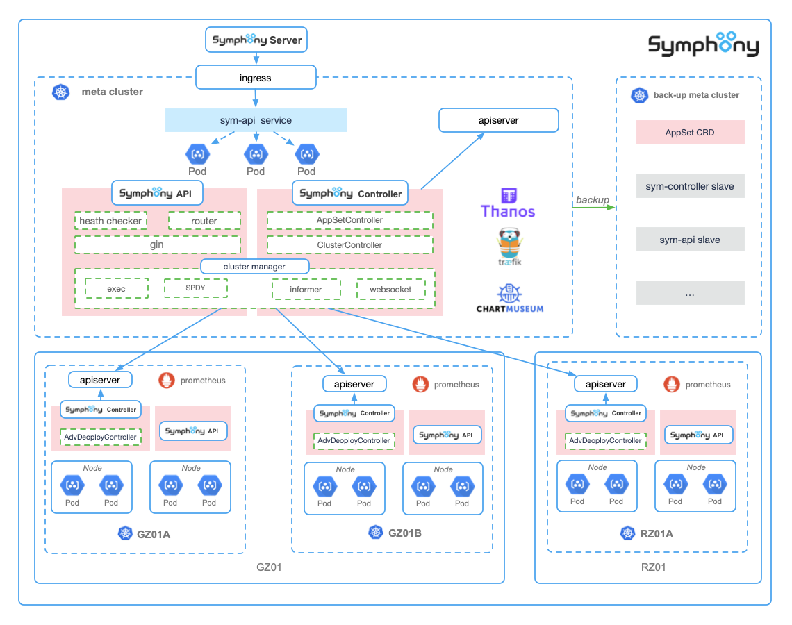

# 概述

# 设计

**功能：**

- 支持混合云基础组件自动部署
- 兼容现有部署方式
- 支持多集群自动迁移
- 支持 k8s 原生 deployment、StatefulSet 等部署方式
- 支持多集群多活、单元化、蓝绿灰等多组高级部署方式
- 后期支持动态注入调度器亲和性调度策略、集群元数据环境

# 架构


## 声明式 api 定义

<u>**声明式**</u>（Declarative）的编程是云原生的一大特色，与<u>**命令式编程**</u>相比，能更好的描述一个效果或者目标的终态。

在 Kubernetes 中，可以直接使用 YAML 文件定义**集群基础组件**部署的终态：

```yaml
apiVersion: devops.dmall.com/v1 # 资源组
kind: Cluster # 资源类型
metadata:
  labels:
    clusterName: az-hk-prod-02
    createdBy: sym-controller
  name: az-hk-prod-02
  namespace: default
spec:
  pause: false # 是否暂停
  symNodeName: aks-v16c128g-16534360-vmss000000 # 指定admin组件运行结点，基础组件不和业务部署在一起
  additionals: # 集群元数据
    area: eastasia
    az: hongkong
    ldc: az-hk-prod-02
  helmSpec: # helm 版本期望
    maxHistory: 5 # 最大历史数
    namespace: kube-system
    overrideImageSpec: gcr.io/kubernetes-helm/tiller:v2.13.1
  apps:
    - name: swift
      repo: dmall
      chartVersion: 0.11.2
      namespace: kube-system
      values:
        "swift-ing": akss2.sym.dmall.com
    - name: monitor # 监控 prometheus 安装期望
      repo: dmall
      namespace: monitoring
      chartVersion: 8.7.0
      values:
        prom-limit-cpu: "24"
        prom-limit-memory: 48Gi
        prom-req-cpu: "16"
        prom-req-memory: 32Gi
        prom-retention: 90d # 数据存储天数
        grafana-ing: aksg2.sym.inner-dmall.com.hk # 访问域名
        prom-ing: aksp2.sym.inner-dmall.com.hk
        alertmanager-ing: aksa2.sym.inner-dmall.com.hk
        lpv-path: /web/prometheus-data
        lpv-size: 200Gi # 监控数据本地存储大小
        custom-resources-config: disable
        selector-only-system: disable
    - name: searchlight # 集群事件报警
      repo: dmall
      namespace: monitoring
      chartVersion: 8.0.3
      values:
        "searchlight-ing": dkstu01.searchlight.dmall.com
    - name: metrics-server # 集群指标
      repo: dmall
      namespace: monitoring
      values:
        sym-affinity: enable # 是否采用亲和性部署
    - name: node-problem-detector # 集群结点内核事件报警组件
      repo: dmall
      chartVersion: 1.5.2
      namespace: monitoring
    - name: traefik # traefik ingress控制器
      repo: dmall
      namespace: kube-system
      values:
        sym-affinity: enable
        dashboard-ing: akst2.sym.dmall.com
        "service.beta.kubernetes.io/azure-load-balancer-internal": "true" # ingress内网负载均衡 暴露服务
    - name: istio # service mesh istio 部署
      repo: dmall
      namespace: istio-system
      appVersion: 1.4.5 # 部署版本
      rawValus: | # istio各组件定制配置
        global:
        proxy:
          accessLogFile: "/dev/stdout"
          resources:
            requests:
              cpu: 10m
              memory: 40Mi

      ...
```

在 Kubernetes 中，直接使用 YAML 文件定义**应用**在<u>**多集群的拓扑结构和状态**</u>：

```yaml
apiVersion: workload.dmall.com/v1beta1
kind: AppSet
metadata:
  name: bbcc
  namespace: default
spec:
  replicas: 10
  podSpec:
    deployType: helm # helm, InPlaceSet，StatefulSet, deployment等， 目前支持helm
    chart: # 仅helm部署时有效
      chartUrl: # helm仓库chart描述
        url: dmall/springBoot
        chartVersion: 0.0.1
      rawChart: ... # 没有helm仓库时可指定原始压缩包  []byte
    template: ... # 非helm部署时，pod的原始描述模板 PodTemplateSpec
  serviceName: inner.bbcc.dmall.com # App 的 service 名称
  updateStrategy: # 升级策略
    upgradeType: canary|blue|green
    minReadySeconds: 10
    canaryClusters: # 灰度部署集群拓扑
      - tcc-bj4-dks-test-01
    needWaitingForConfirm: true
    paused: false
  clusterTopology: # 多集群部署拓扑期望
    clusters:
      - name: tcc-bj4-dks-test-01 # 集群名
        meta: # 集群元数据
          sym-available-zone: bj4
          sym-cluster-info: tcc-bj4-dks-test-01
        podSets: # pod 组集合 蓝、绿、灰等
          - name: bbcc-gz01b-canary
            replicas: 1
            version: v4
            image: ... # 覆盖 image
            chart: ... # 覆盖 chart 仅helm部署时有效
            rawValues: ... # 覆盖 rawValues  仅helm部署时有效
            meta:
              sym-group: canary
          - name: bbcc-gz01b-blue
            replicas: 2
            version: v3
            image: ... # 覆盖 image
            chart: ... # 覆盖 chart 仅helm部署时有效
            rawValues: ... # 覆盖 rawValues  仅helm部署时有效
            meta:
              sym-group: blue
          - name: bbcc-gz01b-green
            replicas: 2 # 覆盖 replicas
            version: v3 # 覆盖 version
            image: ... # 覆盖 image
            chart: ... # 覆盖 chart 仅helm部署时有效
            rawValues: ... # 覆盖 rawValues  仅helm部署时有效
            meta:
              sym-group: green
      - name: tcc-bj5-dks-test-01
        meta:
          sym-available-zone: bj5
          sym-cluster-info: tcc-bj5-dks-test-01
        podSets:
          - name: bbcc-gz01a-canary
            replicas: 1
            version: v4
            image: ... # 覆盖 image
            chart: ... # 覆盖 chart 仅helm部署时有效
            rawValues: ... # 覆盖 rawValues  仅helm部署时有效
            meta:
              sym-group: canary
          - name: bbcc-gz01a-blue
            replicas: 2
            version: v3
            image: ... # 覆盖 image
            chart: ... # 覆盖 chart 仅helm部署时有效
            rawValues: ... # 覆盖 rawValues  仅helm部署时有效
            meta:
              sym-group: blue
          - name: bbcc-gz01a-green
            replicas: 2
            version: v3
            image: ... # 覆盖 image
            chart: ... # 覆盖 chart 仅helm部署时有效
            rawValues: ... # 覆盖 rawValues  仅helm部署时有效
            meta:
              sym-group: green
```

## 控制器模式

由于在多集群中部署，各个资源无法建立ownerReferences关系，也就无法控制从属资源的生命周期；在此基础上引入了Finalizers机制，用户发起删除资源后，控制器查询Finalizers是否为空，待从属资源AdvDeployment、helm release等删除后，清空Finalizers资源也立即被删除。

控制器程序采用**松耦合、高内聚**的模块组合，启动命令如下：

```shell
# 只启动 AppSetController 控制器
$ sym-controller controller --enable-master -v 4

 # 只启动 AdvDeploymentController 控制器
$ sym-controller controller --enable-worker -v 4

# 同时启动 AppSetController 和 AdvDeploymentController 控制器
$ sym-controller controller --enable-master --enable-worker -v 4
```

由于在多集群中部署，各个资源无法建立 ownerReferences 关系，也就无法控制从属资源的生命周期；在此基础上引入了 Finalizers 机制，创建资源的时候控制器会自动注入自己的Finalizer标识，用户发起删除资源后，控制器查询 Finalizers 是否为空，待从属资源 AdvDeployment、helm release 等删除后，删除对应的 Finalizer标识，当 Finalizers 为空立即被删除，可以扩展多控制器对同一个资源的生命周期的管控。

### 实现原理

- AppSetController 作为管理 AppSet 资源的控制器，会在启动时通过 `Informer` 监听多集群不同资源的通知，AppSet 和 AdvDeployment，这些资源的变动加入限速队列触发控制器的调和函数。根据 AppSet 资源期望集群拓扑调和(创建，更新，删除)相应集群的 AdvDeployment 资源。
- AdvDeploymentController 作为单一集群内管理 AdvDeployment 的控制器，helm 方式部署时通过客户端发布 release，然后监听`Informer`集群内多种资源 deployment、StatefulSet、service、endpoint、pod、event、configmap 的状态变化，聚合应用总的部署状态。
- 状态收集，触发回调后，获取 AdvDeployment 资源状态然后统一聚合。

部署完成后可以看到部署的状态：

```shell
$ kubectl get as --all-namespaces
NAMESPACE     NAME                      DESIRED   AVAILABLE   UNAVAILABLE   VERSION   STATUS    AGE
dmall-inner   kafka-08-producer-gz01a   6         6           0             v8/v9     Running   3h37m
dmall-inner   kafka-test-group          8         8           0             v2        Running   54m
dmall-inner   no-project-aabb           10        10          0             v5        Running   47h

$ kubectl get ad --all-namespaces
NAMESPACE     NAME                      DESIRED   AVAILABLE   UNAVAILABLE   VERSION   STATUS    AGE
dmall-inner   kafka-08-producer-gz01a   2         2           0             v8/v9     Running   3h39m
dmall-inner   kafka-test-group          4         4           0             v2        Running   56m
dmall-inner   no-project-aabb           4         4           0             v5        Running   47h
```

### 多集群管理

```go
// Cluster ...
type Cluster struct {
	Name          string
	AliasName     string
	RawKubeconfig []byte
	Meta          map[string]string
	RestConfig    *rest.Config
	Client        client.Client
	KubeCli       kubernetes.Interface

	log             logr.Logger
	Mgr             manager.Manager
	Cache           cache.Cache
	internalStopper chan struct{}

	Status ClusterStatusType
	// Started is true if the Informers has been Started
	Started bool
}
// ClusterManager ...
type ClusterManager struct {
	MasterClient
	mu             *sync.RWMutex
	Opt            *ClusterManagerOption
	clusters       []*Cluster
	PreInit        func()
	Started        bool
	ClusterAddInfo chan map[string]string
}
```
- 集群感知，通过通过 `Informer` 监听meta集群 configmap 资源变化，获取配置后初始化客户端，可以运行后动态增加删除基础，修改元数据。
- 创建一些额外的资源索引后开启 Informer cache 同步协程，等待资源同步完成。
- 同时开启一个后台协程负责集群健康检查，根据一定策略删除和恢复集群管理。

### 健康检查

``` go
type Handler interface {
	Routes() []*router.Route
	AddLivenessCheck(name string, check Check)
	AddReadinessCheck(name string, check Check)
	LiveEndpoint(ctx *gin.Context)
	ReadyEndpoint(ctx *gin.Context)
	RemoveLivenessCheck(name string)
	RemoveReadinessCheck(name string)
}
```
### 监控指标

```go
// 注册http监控指标
func RegisterGinView() error {
	// Register stat views
	err := view.Register(
		// Gin (HTTP) stats
		ochttp.ServerRequestCountView,
		ochttp.ServerRequestBytesView,
		ochttp.ServerResponseBytesView,
		ServerLatencyView,
		ochttp.ServerRequestCountByMethod,
		ServerResponseCountByStatusCode,
	)
	return nil
}

// NewRouter creates a new Router instance
func NewRouter(opt *Options) *Router {
	engine := gin.New()
    ...
	r := &Router{
		Engine:              engine,
		Routes:              make(map[string][]*Route, 0),
		ProfileDescriptions: make([]*Profile, 0),
	}
  
	if opt.MetricsEnabled {
		metrics.RegisterGinView()
		r.Engine.GET("/metrics", gin.HandlerFunc(func(c *gin.Context) {
			p.Exporter.ServeHTTP(c.Writer, c.Request)
		}))
	}

	if opt.PprofEnabled {
		// automatically add routers for net/http/pprof e.g. /debug/pprof, /debug/pprof/heap, etc.
		ginpprof.Wrap(r.Engine)
	}
    ...
	return r
}
```

### 高可用部署

**集群内高可用**

- sym-controller以（类似于k8s原生controller manager的deployment）  方式部署三个 pod，但同一时间控制器只允许一个运行。
- 通过分布式锁来确保只有一个控制器处于运行状态，其他的控制器都是准备好资源处于就绪态，一旦运行态的控制器挂掉，其他就绪态的控制器可以争抢锁然后快速进入运行态。

集群外高可用

- sym所有相关组件均安装在独立的meta集群中，从物理上与业务集群物理隔离。
- 实时同步所有资源（as、adv等）到远程 meta 备用集群作为冷备数据，远程 meta 备用集群中暂时不开启sym-controller。
- 主 meta 集群不能工作时，管理员手动拉起远程备 meta 集群控制器后正常工作。

## API 组件

资源获取采用标准 HTTP RESTful 接口提供，启动命令：

```shell
# 集群内部部署
$ sym-api api -v 4

# 集群外部部署, kubeconfig 指向 meta 集群
$ sym-api api --kubeconfig=./manifests/kubeconfig_TCC_BJ5_DKS_MONIT_01.yaml -v 4
```

### API 调用流程

大部分接口都从集群 `Informer` 中进行查询，具有缓存机制且资源状态与集群有较高一致性。保证高并发下不会对集群造成太大的查询压力。

### API 说明

#### 1. `GET /api/cluster/:name`

获取所有（或某个）集群状态信息。

#### 2. `GET /api/cluster/:name/namespace/:namespace/app/:appName/resource`

获取所有（或某个）集群的主要资源，包括 `Pod`、`Deployment`、`Service` 等。

#### 3. `GET /api/cluster/:name/appPod/:appName`

获取所有（或某个）集群单个 `App` 的所有 `Pod`。可通过各类 `labels` 进行筛选，如蓝绿灰分组、单元名称和 LDC 标签等。

#### 4. `GET /api/cluster/:name/appPod/:appName/helm`

获取所有（或某个）集群应用的 `Helm` 版本。可使用分组、单元名称等进行正则匹配。 后端使用 `goroutine` 并发为每个集群创建客户端，通过 `port-forward` 映射集群 `Tiller` 服务至本地， 再调用服务端 `gRPC Streaming` 接口获取相关信息。

#### 5. `POST /api/cluster/:name/namespace/:namespace/app/:appName/restart`

重启所有（或某个）集群中应用的所有 `Pod`，可通过蓝绿灰分组、单元名称进一步筛选。

#### 6. `GET /api/cluster/:name/endpoints/:appName`

获取所有（或某个）集群中应用的 `Endpoints`，可通过蓝绿灰分组、单元名称进一步筛选。

#### 7. `GET /api/cluster/:name/terminal`

该接口为用户提供交互式终端。使用 `Websocket` 长连接接入后，可通过 `tty`、`stdin`、`stdout`、`stderr`等参数初始化， 并实时响应 `xterm` 前端组件传入的 `resize` 请求，成功后使用 `SPDY` 协议与 `K8s` 进行全双工通信。

#### 8. `GET /api/cluster/:name/exec`

该接口用于在容器内执行单次命令。该接口为 HTTP 短连接，运行后返回容器执行结果。

#### 9. `GET /api/cluster/:name/deployments/stat`

获取所有（或某个）集群中 `Deployment` 的统计信息。包括 `DesiredReplicas`、`UpdatedReplicas`、`ReadyReplicas`、`AvailableReplicas`、`UnavailableReplicas`等。

#### 10. `GET /api/cluster/:name/namespace/:namespace/pods/:podName/event`

获取所有（或某个）集群中 `Pod` 的 `Event` 信息。

#### 11. `GET /api/cluster/:name/namespace/:namespace/pods/:podName/logs`

获取指定 `Pod` 的容器标准化输出日志。通过参数可控制返回行数、是否实时刷新、日志开始时间戳，也可获取上个被销毁的 `Pod` 日志。 开启`follow` 将使用流式输出。

#### 12. `GET /api/pod/logfiles`

获取指定 `Pod` 中的日志文件列表。后台通过 `exec` 接口进行遍历，兼容新旧两种日志存储逻辑。

#### 13. `GET /api/cluster/:name/namespace/:namespace/pods/:podName/logs/file`

获取指定 `Pod` 中的日志文件内容。支持 `tail` 命令参数。
