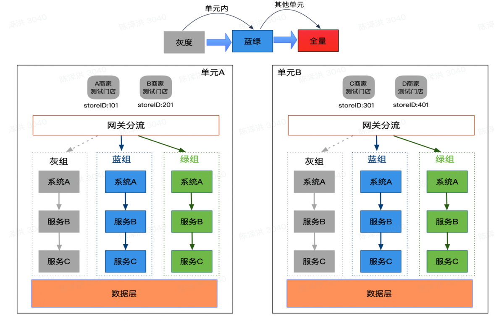
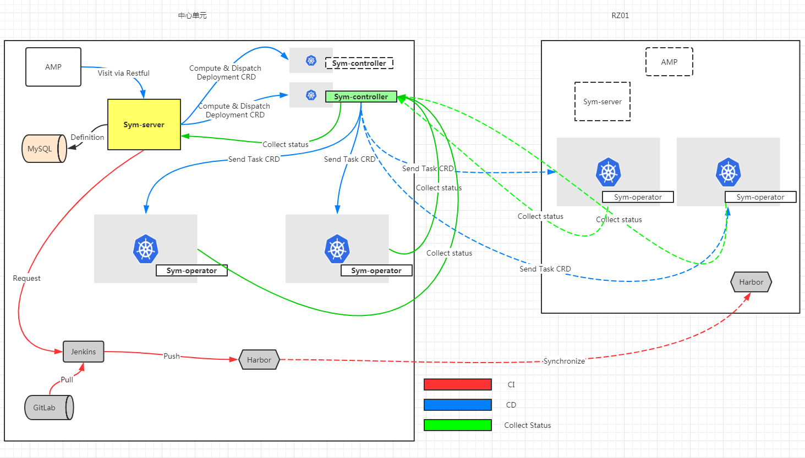

# 单元化流程说明

本文档基于组内会议讨论，主要用来统一整个部署发布单元化的流程，便于后续开发时查阅。

## 一、关键概念

主要对一些关键概念做出解释及统一，避免理解错误及关系混淆。

### 1. 机房

机房基于 IDC 或公有云搭建，目前拟建设四个机房，分别为北京机房、重庆机房、上海机房、广州机房。
其中北京机房有亦庄及腾讯云两个可用区。其他机房暂定只有 1 个可用区（不排除后续扩展的可能）。

### 2. 单元

单元是基于地理位置对应用部署及业务服务进行分类的一个抽象概念，单元分布与地理位置对应。主要分为中心单元和边缘单元两种。具体如下：

1. 中心单元（Global Zone）：中心单元目前仅北京机房一个区域，目前有亦庄和腾讯云两个可用区。

2. 边缘单元（Regional Zone）：边缘单元主要有重庆机房、上海机房、广州机房三个区域，目前这些机房仅有 1 个可用区。

### 3. 集群

集群主要指 K8s 集群，理论上每个**可用区**仅搭建 1 个集群。

### 4. 分组

根据部署方式的不同，**同一应用**在各单元的实例分灰、蓝、绿三组。比较特殊的中心单元，将所有应用的蓝组实例置于亦庄，绿组实例置于腾讯云。其他单元蓝绿灰组在同一可用区。需要注意的是，蓝绿灰分组不是基于集群中的节点，如将某些节点事先规划为蓝组节点，剩余的为绿组节点，而是在创建应用的时候，根据实例数确定，同组的实例可在集群中的节点上漂移。

关于灰组，每个单元默认且至多有两个实例（为了兼容某些需要高可用的服务，及中心单元两个可用区的情况），在边缘单元中可调整为单个实例。中心化应用的灰组实例在中心单元中每个可用区维护一个。灰组实例在应用创建时都会初始化，只不过未勾选灰度发布的情况下实例数为 0。

### 5. 应用

应用主要分中心化应用和单元化应用。

1. 中心化应用：如会员中心等无法单元化的应用，只能在中心单元部署，且须分布在两个可用区保持多活。
2. 单元化应用：可单元化的服务，需要部署到所有单元（包括中心单元）。

### 6. 发布方式

根据是否自动及是否选择灰度可分为四种方式：

1. 先灰度，后手动蓝绿
2. 无灰度的蓝绿发布
3. 自动蓝绿（灰度的版本也需要升级到新版本）

自动发布的灰度没有意义所以不在考虑范围内。

### 7. 路由因子

路由因子主要有三种：

1. 商家ID：主要用来选择单元
2. 门店ID：主要用来选择分组
3. 用户ID：主要用来选择特定用户进入灰度分组

## 二、发布流程

1. 选择单元：中心化应用选择中心单元，单元化应用选择首发单元（任意单元）。
2. 选择是否进行灰度发布：若不执行灰度发布，直接进行蓝绿发布。若选择灰度发布，先发灰度后等待验证。验证通过后进入蓝绿发布环节。
3. 选择是否自动蓝绿发布：若手动蓝绿，中途会暂停等待验证，否则自动执行至该单元发布完成。
3. 选择其他单元：单元化服务在首发单元验证完毕后，可选择在其他单元（可多选，在剩余的单元中同时发布）执行上述流程。其他单元上也可选择是否灰度和是否自动蓝绿。

## 三、相关设计

各组件调用关系设计如下；

每个应用创建时在同一单元下初始化三个 Deployment（暂定）对应蓝绿灰组，根据设置的实例数平均分配至蓝绿组，若有灰度则另外初始化 2 个灰度实例，否则灰度实例数为 0。

Service 的设计有待探讨。

## 四、回滚流程

待补充。

## 五、FAQ

1. 多集群（中心单元）Service 的设计问题
2. 同一集群下蓝绿灰组实例的 Service 设计问题

